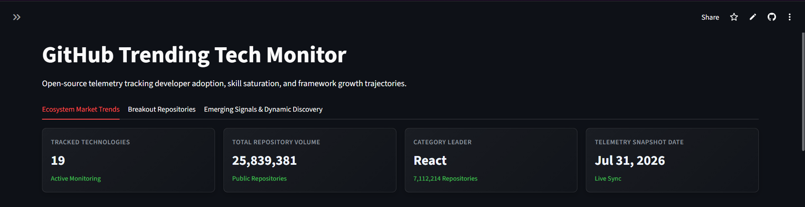
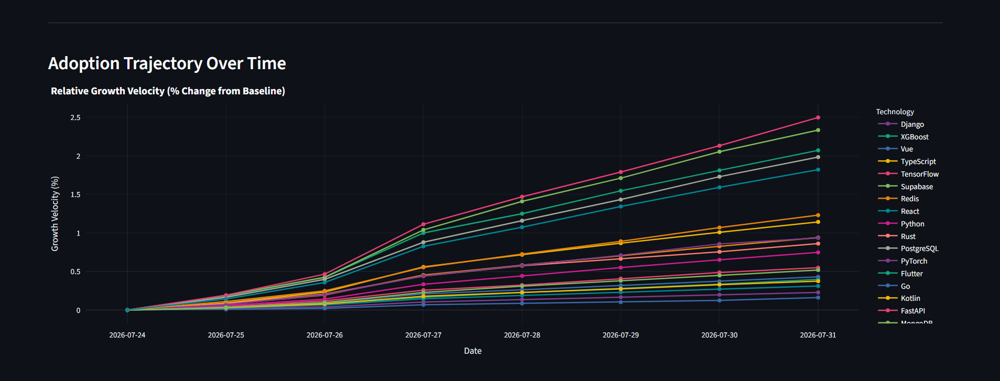
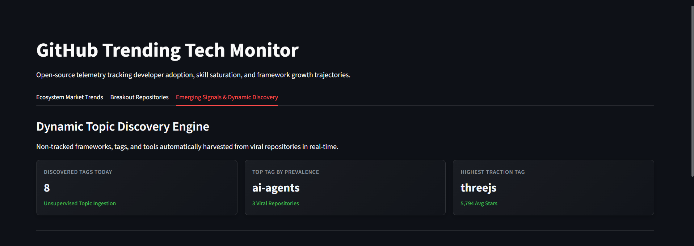
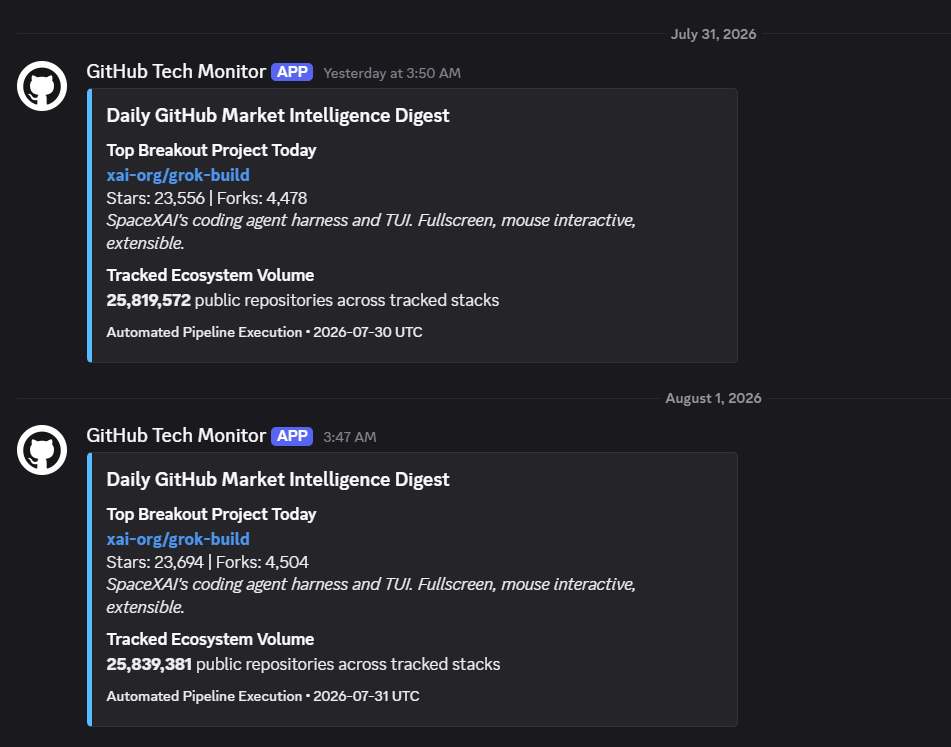

# GitHub Trending Tech Monitor

[](https://github.com/ns1234PLa/github_trending_tech_monitor/actions)
[](https://supabase.com)
[](https://streamlit.io)

An automated market intelligence platform that tracks open-source software adoption, monitors technology stack trajectories, and uncovers emerging framework signals in real time using the GitHub REST API and Supabase PostgreSQL.
 
### 🚀 [View Live Dashboard](https://apptrendingtechmonitor-tfwasbaavrm3aumejxfcj2.streamlit.app/)
 
Explore market saturation quadrants, breakout repositories, and emerging technology signals interactively.

---

## Platform Preview

###  Real-Time Telemetry & Market Saturation


###  Adoption Trajectory Over Time


###  Unsupervised Dynamic Topic Discovery


###  Automated Daily Pipeline & Discord Digests


---

## Key Capabilities

- **Core Stack Telemetry** — Monitors aggregate repository volumes and adoption metrics across technology categories (Frameworks, Languages, Databases, AI/ML).
- **Breakout Project Detection** — Identifies high-velocity repositories created in the last 30 days, measuring star growth rates, fork ratios, and developer engagement scores.
- **Dynamic Topic Discovery** — Extracts emerging tags and framework signals from trending projects to detect new tools before broad market adoption.
- **Interactive Analytics Interface** — Market saturation quadrant analysis, relative growth velocity tracking, category mindshare distribution, and dynamic topic radars (Streamlit + Plotly).
- **Automated Data Pipeline** — Scheduled GitHub Actions workflow with Discord webhook notifications for daily digests.

---

## System Architecture

```
                 +----------------------------------+
                 |   GitHub Actions (Cron / CI)     |
                 +----------------------------------+
                                  |
                              (Triggers)
                                  v
  +------------------+   +--------------------------+   +-------------------+
  |  GitHub REST API |-->| Python ETL Engine        |-->| Discord Webhook   |
  |  (Raw Telemetry) |   | (`fetch_github_data.py`) |   | (Daily Digest)    |
  +------------------+   +--------------------------+   +-------------------+
                                  |
                       (Upserts Clean Telemetry)
                                  v
                     +--------------------------+
                     |   Supabase Database      |
                     |   (PostgreSQL + RLS)     |
                     +--------------------------+
                                  ^
                                  |
                      (Reads Aggregated Data)
                                  |
                     +--------------------------+
                     |   Streamlit Dashboard    |
                     |   (`dashboard/app.py`)   |
                     +--------------------------+
```

---

## Technology Stack

| Component | Technology |
|-----------|-----------|
| **Language** | Python 3.10+ |
| **Database** | Supabase (PostgreSQL with Row Level Security) |
| **Visualization** | Streamlit, Plotly, Pandas |
| **Automation** | GitHub Actions, Discord Webhooks |
| **Core Libraries** | requests, python-dotenv, supabase-py |

---

## Local Development Setup

### 1. Clone and Environment

```bash
git clone https://github.com/ns1234PLa/github_trending_tech_monitor.git
cd github_trending_tech_monitor

python -m venv venv

# On Windows:
.\venv\Scripts\activate
# On macOS/Linux:
source venv/bin/activate

pip install -r requirements.txt
```

### 2. Environment Configuration

Copy the sample environment file and add your credentials:

```bash
cp .env.example .env
```

Fill in `.env` with your API keys:

```env
SUPABASE_URL=your_supabase_project_url
SUPABASE_KEY=your_supabase_service_role_key
GITHUB_TOKEN=your_github_personal_access_token
DISCORD_WEBHOOK_URL=your_discord_webhook_url
```

### 3. Running the Pipeline & Dashboard

Execute the ETL ingestion pipeline:

```bash
python scripts/fetch_github_data.py
```

Launch the Streamlit analytics dashboard:

```bash
streamlit run dashboard/app.py
```

---

## Repository Structure

```
github_trending_tech_monitor/
├── .github/
│   └── workflows/
│       └── daily_ingestion.yml      # Scheduled ETL execution workflow
├── assets/                     
│   ├── auto_discovered.png
│   ├── dashboard_overview.png
│   ├── discord_digest.png
│   ├── emerging_topics.png
│   └── growth_velocity.png
├── dashboard/
│   └── app.py                       # Streamlit analytics interface
├── scripts/
│   └── fetch_github_data.py         # Core ingestion and analysis pipeline
├── .env.example                     # Environment variable blueprint
├── .gitignore                       # Git exclusion rules
├── README.md                        
└── requirements.txt                               
```

---

## Run Locally

1. **Set up credentials** (follow Local Development Setup above)
2. **Execute the pipeline**: `python scripts/fetch_github_data.py`
3. **Launch the dashboard**: `streamlit run dashboard/app.py` *(currently under active UI development)*
4. **View metrics** at `http://localhost:8501`

---

## Automated Execution

The ETL pipeline runs daily via GitHub Actions with zero manual intervention. Each execution ingests fresh telemetry, updates the database, and sends a digest to Discord.

**Configuration**: See `.github/workflows/daily_ingestion.yml` for cron schedule and webhook settings.

**Manual execution** is supported for ad-hoc testing: `python scripts/fetch_github_data.py`

---
